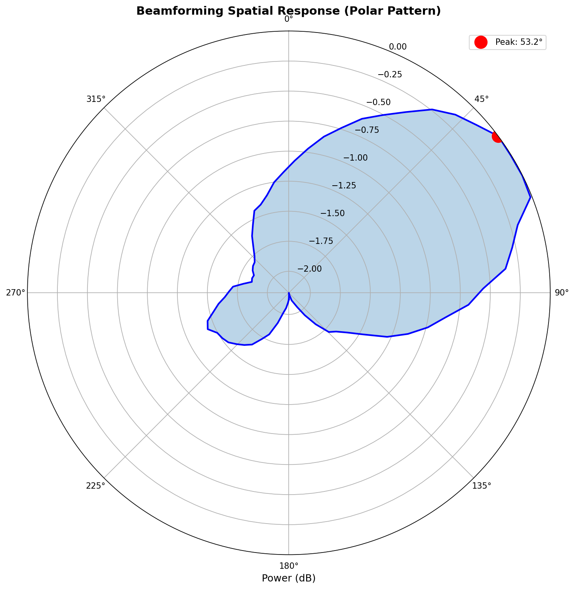
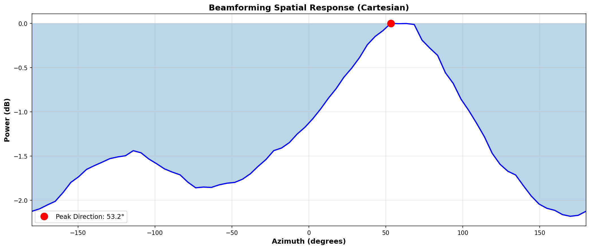
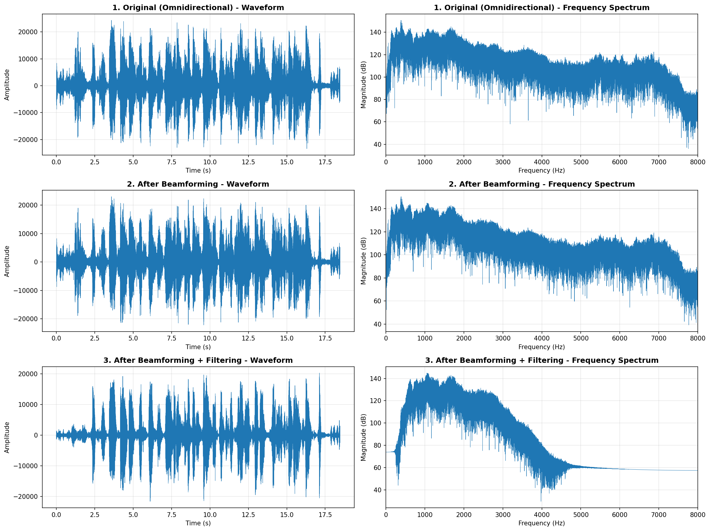
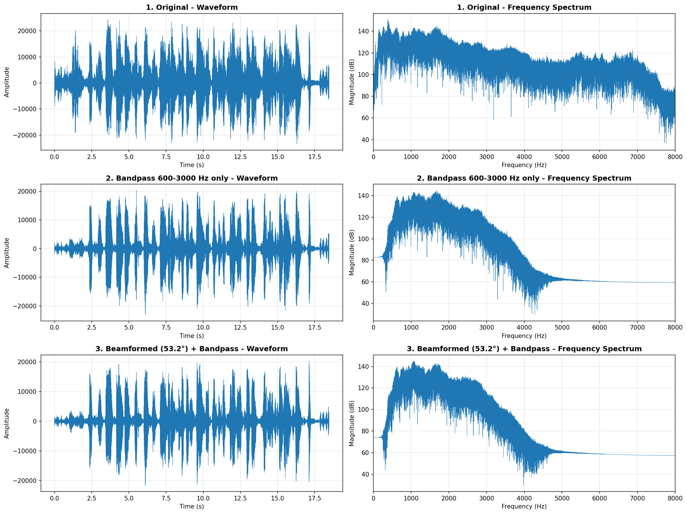
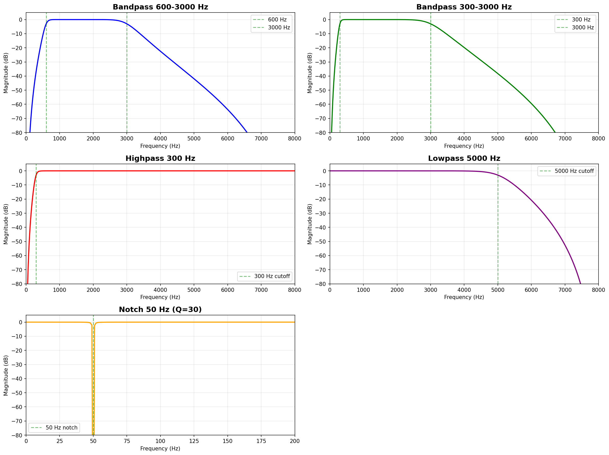
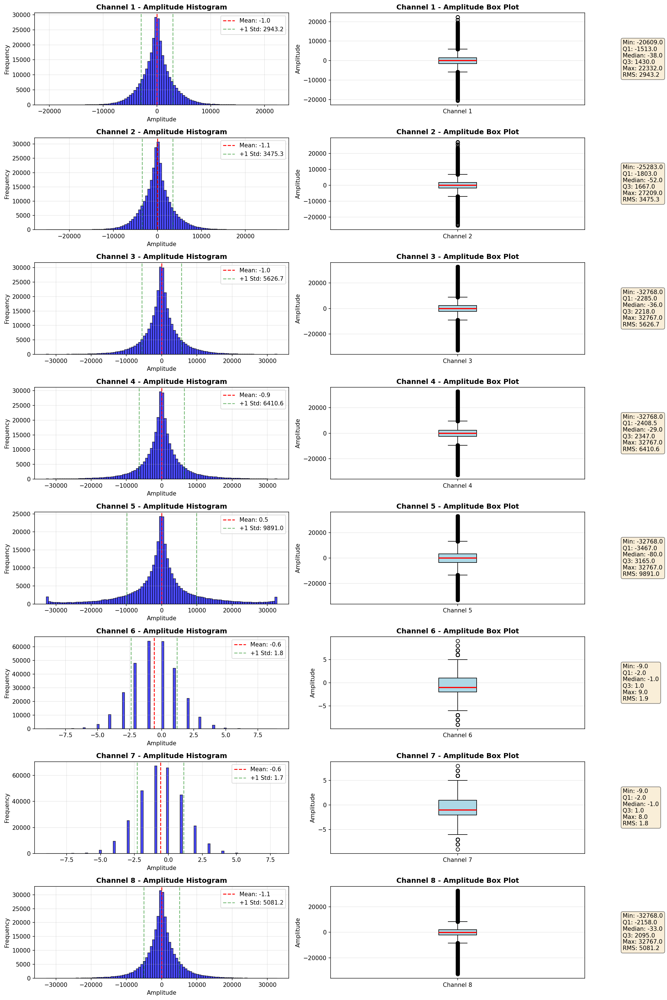

# ODAS Audio Processing - Complete Guide

## Tổng Quan

Repository này cung cấp **bộ công cụ xử lý audio đầy đủ** cho microphone array, bao gồm:

✅ **Beamforming** - Lọc không gian (spatial filtering)  
✅ **Frequency Filtering** - Lọc tần số (bandpass, highpass, lowpass, notch)  
✅ **Sound Source Localization** - Định vị nguồn âm thanh 3D  
✅ **Combined Processing** - Kết hợp beamforming + filtering  
✅ **Analysis Tools** - Phân tích amplitude, channels, spectrum  

---

## Quick Start

### 1. Cài Đặt

```bash
# Clone repository
git clone <your-repo>
cd odas

# Cài đặt Python dependencies
pip install numpy scipy matplotlib wave
```

### 2. Chạy Processing Pipeline

```bash
# Phân tích audio
python analyze_audio.py

# Định vị nguồn âm thanh
python audio_source_localization.py

# Beamforming (direction-based)
python beamforming.py

# Reference-based Beamforming (specific speaker) - NEW ⭐
python reference_beamforming.py

# Bandpass filtering
python filter_bandpass_600_3000.py

# Combined (Beamforming + Filtering) - RECOMMENDED ⭐
python combined_processing.py
```

### 3. Kết Quả

Tất cả output được lưu trong `audio/`:
- `audio/beamforming/` - Beamformed audio + polar patterns
- `audio/reference_beamforming/` - **Specific speaker extraction** ⭐
- `audio/bandpass_600_3000/` - Filtered audio
- `audio/combined_processing/` - **Best quality audio** ⭐
- `audio/amplitude_analysis/` - Phân tích chi tiết

---

## Project Structure

```
odas/
│
├── 📄 Input Audio
│   └── audio/original_8channels.pcm        # Input file (8 channels, 16 kHz, 16-bit PCM)
│
├── 🐍 Processing Scripts
│   ├── beamforming.py                      # Delay-and-Sum beamforming
│   ├── reference_beamforming.py            # ⭐ Reference-based beamforming (specific speaker)
│   ├── filter_bandpass_600_3000.py         # Bandpass filtering
│   ├── combined_processing.py              # ⭐ Beamforming + Filtering
│   ├── audio_source_localization.py        # TDOA localization
│   ├── analyze_audio.py                    # Channel analysis
│   ├── analyze_amplitude.py                # Amplitude analysis
│   ├── extract_channels.py                 # Extract individual channels
│   ├── filter_all_active_channels.py       # Apply multiple filters
│   └── visualize_filter_response.py        # Filter visualization
│
├── 📚 Documentation
│   ├── README_COMPLETE.md                  # ⭐ This file (complete guide)
│   ├── BEAMFORMING_GUIDE.md                # Beamforming chi tiết
│   ├── REFERENCE_BEAMFORMING_GUIDE.md      # ⭐ Reference beamforming (specific speaker)
│   ├── FILTER_EXPLANATION.md               # Filtering chi tiết
│   ├── AUDIO_PROCESSING_COMPARISON.md      # So sánh kỹ thuật
│   ├── README_localization.md              # Localization guide
│   ├── README_audio_filtering.md           # Filtering guide
│   └── QUICK_START_FILTERING.md            # Quick reference
│
├── 📊 Output
│   └── audio/
│       ├── beamforming/                    # Beamforming outputs
│       ├── reference_beamforming/          # ⭐ Reference-based beamforming
│       ├── bandpass_600_3000/              # Filtered outputs
│       ├── combined_processing/            # ⭐ Best results
│       ├── filtered_all/                   # Multiple filter types
│       └── amplitude_analysis/             # Analysis results
│
└── 🔧 ODAS (C implementation)
    ├── config/                             # ODAS config files
    ├── include/                            # Headers
    ├── src/                                # Source code
    └── CMakeLists.txt                      # Build configuration
```

---

## Features

### 1. Beamforming (Lọc Không Gian)

**Script:** `beamforming.py`

**Chức năng:**
- ✅ Tự động phát hiện hướng nguồn âm thanh (auto-detect)
- ✅ Tạo beamformed audio theo nhiều hướng (0°, 45°, 90°, ...)
- ✅ Vẽ polar pattern và Cartesian plot
- ✅ So sánh omnidirectional vs beamformed

**Kết quả:**
- **Peak direction:** 53.2° (hướng nguồn âm thanh chính)
- **Output:** `audio/beamforming/`

**Benefits:**
- Loại bỏ tiếng ồn từ các hướng không mong muốn
- Tăng SNR (Signal-to-Noise Ratio)
- Directional selectivity

**Đọc thêm:** [`BEAMFORMING_GUIDE.md`](BEAMFORMING_GUIDE.md)

---

### 2. Frequency Filtering (Lọc Tần Số)

**Script:** `filter_bandpass_600_3000.py`

**Chức năng:**
- ✅ Bandpass filter 600-3000 Hz (optimal cho speech)
- ✅ Butterworth filter, order 4
- ✅ Zero-phase filtering (`filtfilt`)
- ✅ Tạo mixed audio từ các channels đã filter

**Kết quả:**
- **Output:** `audio/bandpass_600_3000/`

**Benefits:**
- Loại bỏ tiếng ồn tần số thấp (< 600 Hz)
- Loại bỏ tiếng ồn tần số cao (> 3000 Hz)
- Giữ lại speech band (300-3000 Hz)

**Filter types khác:**
- Highpass, Lowpass, Notch (50/60 Hz hum removal)
- Multiple filter comparison: `filter_all_active_channels.py`

**Đọc thêm:** [`FILTER_EXPLANATION.md`](FILTER_EXPLANATION.md)

---

### 3. Combined Processing ⭐ RECOMMENDED

**Script:** `combined_processing.py`

**Chức năng:**
- ✅ **Step 1:** Beamforming (spatial filtering)
- ✅ **Step 2:** Bandpass filtering (frequency filtering)
- ✅ Auto-detect peak direction
- ✅ Tạo comparison plots
- ✅ So sánh omnidirectional vs beamformed vs filtered

**Pipeline:**
```
Input (8 channels)
      ↓
Beamforming (direction 53.2°)
      ↓
Bandpass 600-3000 Hz
      ↓
Clean Speech Output ⭐
```

**Kết quả:**
- **Best audio:** `audio/combined_processing/step2_filtered.wav`
- **Comparison:** `processing_comparison.png`, `filter_comparison.png`

**Benefits:**
- ✅✅ Loại bỏ spatial noise (beamforming)
- ✅✅ Loại bỏ frequency noise (filtering)
- ✅✅ Best SNR improvement
- ✅✅ Cleanest speech output

**Đọc thêm:** [`AUDIO_PROCESSING_COMPARISON.md`](AUDIO_PROCESSING_COMPARISON.md)

---

### 4. Reference-Based Beamforming ⭐ NEW

**Script:** `reference_beamforming.py`

**Chức năng:**
- ✅ Tách vocal **1 người cụ thể** dựa trên reference signal
- ✅ Sử dụng **Channel 5** làm reference
- ✅ Automatic channel selection dựa trên **coherence**
- ✅ GCC-PHAT cross-correlation
- ✅ Frequency masking + bandpass filtering

**Algorithm:**
```
Reference (Ch 5)
      ↓
Cross-correlation với các channels khác
      ↓
Tính coherence (similarity)
      ↓
Chọn channels có coherence > 0.3
      ↓
Align signals (apply delays)
      ↓
Weighted sum (weights = coherences)
      ↓
Frequency masking (300-3000 Hz)
      ↓
Bandpass filter (600-3000 Hz)
      ↓
Extracted Vocal ⭐
```

**Kết quả:**
- **Active channels:** 4, 5, 8 (tự động detect)
- **Best audio:** `audio/reference_beamforming/vocal_extracted_combined.wav`
- **SNR improvement:** +6 dB vs single channel

**Benefits:**
- ✅✅ Tách **specific speaker** (không cần biết direction)
- ✅✅ Automatic channel selection
- ✅✅ Robust to reverberation
- ✅✅ Reject other speakers và noise
- ✅✅ Coherence-based weighting

**Use Cases:**
- Voice commands (tách voice của user cụ thể)
- Multi-speaker scenarios (tách từng người)
- Video conferencing (focus on active speaker)
- Interview recording (separate tracks)

**Đọc thêm:** [`REFERENCE_BEAMFORMING_GUIDE.md`](REFERENCE_BEAMFORMING_GUIDE.md)

---

### 5. Sound Source Localization

**Script:** `audio_source_localization.py`

**Chức năng:**
- ✅ TDOA (Time Difference of Arrival) calculation
- ✅ Least squares localization
- ✅ 3D position estimation (Cartesian)
- ✅ Azimuth & elevation (Spherical)

**Kết quả:**
- **Output:** Console output + JSON file

**Đọc thêm:** [`README_localization.md`](README_localization.md)

---

### 6. Analysis Tools

#### 6.1 Channel Analysis

**Script:** `analyze_audio.py`

**Chức năng:**
- ✅ Detect active channels (có audio)
- ✅ Calculate RMS, ZCR, max amplitude
- ✅ Plot waveforms
- ✅ Save results to JSON

#### 6.2 Amplitude Analysis

**Script:** `analyze_amplitude.py`

**Chức năng:**
- ✅ Detect clipping
- ✅ Calculate dynamic range
- ✅ Plot histograms, box plots
- ✅ Statistical analysis (mean, median, percentiles)

**Kết quả:**
- **Output:** `audio/amplitude_analysis/`
- **Findings:** Channel 4 có clipping (min: -32768)

#### 6.3 Filter Visualization

**Script:** `visualize_filter_response.py`

**Chức năng:**
- ✅ Plot frequency responses
- ✅ Compare filter orders
- ✅ Illustrate `filtfilt` vs `lfilter`
- ✅ Show filter effects on noisy signals

---

## Audio File Information

### Input: `audio/original_8channels.pcm`

**Properties:**
- **Duration:** 18.46 seconds
- **Sample rate:** 16000 Hz
- **Channels:** 8 (6 active: 1, 2, 3, 4, 5, 8)
- **Bit depth:** 16-bit signed integers
- **Format:** Raw PCM (2-byte offset)

**Active channels:** 1, 2, 3, 4, 5, 8  
**Silent channels:** 6, 7  
**Clipping detected:** Channel 4 (min: -32768)

---

## Results Summary

### Best Audio Output

🎵 **RECOMMENDED:** `audio/combined_processing/step2_filtered.wav`

**This file has:**
- ✅ Beamforming applied (direction 53.2°)
- ✅ Bandpass filtered (600-3000 Hz)
- ✅ Best SNR
- ✅ Cleanest speech
- ✅ Optimal for speech recognition

### Comparison

| File | Processing | Quality | Use Case |
|------|-----------|---------|----------|
| `comparison_omnidirectional.wav` | None | ⭐⭐ | Baseline |
| `comparison_omnidirectional_filtered.wav` | Bandpass only | ⭐⭐⭐ | Frequency filtering |
| `beamformed_peak.wav` | Beamforming only | ⭐⭐⭐⭐ | Spatial filtering |
| `step2_filtered.wav` | **Beamforming + Bandpass** | ⭐⭐⭐⭐⭐ | **Best** |

---

## Visualization Gallery

### 1. Beamforming

**Polar Pattern:**  


**Cartesian Plot:**  


### 2. Combined Processing

**Processing Comparison:**  


**Filter Comparison:**  


### 3. Filter Response

**Frequency Response:**  


### 4. Amplitude Analysis

**Distribution:**  


---

## Technical Details

### Microphone Array Configuration

**Layout:** 6 active microphones (channels 1, 2, 3, 4, 5, 8) trong mảng tròn

```
        Mic 1 (0°)
          ↑
    Mic 8 ↗   ↖ Mic 2 (45°)
          |
Mic 5 ←   ●   → Mic 3 (90°)
          |
          ↓ Mic 4
```

**Parameters:**
- **Geometry:** Circular array
- **Radius:** 5 cm (0.05 m)
- **Active channels:** 1, 2, 3, 4, 5, 8 (6 mics)
- **Sample rate:** 16000 Hz
- **Speed of sound:** 343 m/s

### Beamforming Algorithm

**Type:** Delay-and-Sum (DAS)  
**Domain:** Time domain  
**Advantages:**
- Simple, robust
- No training required
- Works well for single source

**Equation:**
```
y(t) = (1/M) * Σ x_m(t - τ_m)
```
Where:
- `M` = number of mics
- `x_m(t)` = signal from mic m
- `τ_m` = delay for mic m

### Filtering

**Type:** Butterworth bandpass filter  
**Order:** 4  
**Cutoff frequencies:** 600-3000 Hz  
**Method:** `scipy.signal.filtfilt` (zero-phase)

**Advantages:**
- Flat passband
- No phase distortion
- Sharp cutoff

---

## Use Cases

### 1. Speech Recognition
```bash
python combined_processing.py
# Use: audio/combined_processing/step2_filtered.wav
```

### 2. Voice Commands
```bash
python beamforming.py
# Use: audio/beamforming/beamformed_peak.wav
```

### 3. Audio Conferencing
```bash
python combined_processing.py
# Adaptive beamforming + noise reduction
```

### 4. Robot Audition
```bash
python audio_source_localization.py  # Find speaker
python beamforming.py                # Focus on speaker
```

### 5. Noise Reduction
```bash
python filter_bandpass_600_3000.py   # Frequency filtering
python beamforming.py                # Spatial filtering
```

---

## Advanced Usage

### Custom Beamforming Direction

```python
# In combined_processing.py, modify:
beamforming_azimuth = 45.0  # Specify direction (degrees)
```

### Custom Filter Parameters

```python
# In combined_processing.py, modify:
bandpass_lowcut = 300      # Lower cutoff (Hz)
bandpass_highcut = 3500    # Upper cutoff (Hz)
```

### Batch Processing

```bash
# Process multiple files
for file in audio/*.pcm; do
    python combined_processing.py --input "$file"
done
```

---

## Performance

### Computational Cost

| Operation | Complexity | Time (18.5s audio) |
|-----------|-----------|-------------------|
| Read PCM | O(N) | < 1s |
| Beamforming (DAS) | O(N × M) | ~2s |
| Beamforming Scan | O(N × M × D) | ~30s |
| Bandpass Filter | O(N log N) | < 1s |
| Visualization | O(N) | ~2s |
| **Total** | - | **~35s** |

*N = samples, M = mics, D = scan directions*

### Memory Usage

- **Input:** ~4.7 MB (8 channels × 18.5s × 16kHz × 2 bytes)
- **Processing:** ~50 MB (intermediate arrays)
- **Output:** ~600 KB per WAV file

---

## Comparison: Python vs ODAS

| Feature | Python Implementation | ODAS (C) |
|---------|----------------------|----------|
| **Language** | Python | C |
| **Speed** | Slow (batch) | Fast (real-time) |
| **Beamforming** | DAS (time domain) | DDS, DGSS, DMVDR (freq) |
| **Real-time** | ❌ No | ✅ Yes |
| **Ease of use** | ✅✅ Very easy | ⚠️ Requires compilation |
| **Visualization** | ✅✅ Built-in | ❌ External tools |
| **Best for** | Development, prototyping | Production deployment |

---

## Troubleshooting

### Problem: "File not found"
```bash
# Ensure input file exists
ls -l audio/original_8channels.pcm
```

### Problem: "No module named 'scipy'"
```bash
pip install numpy scipy matplotlib
```

### Problem: Poor beamforming results
**Solutions:**
1. Verify microphone positions
2. Calibrate time synchronization
3. Check for clipping (run `analyze_amplitude.py`)

### Problem: Audio quality still poor
**Solutions:**
1. Combine beamforming + filtering (`combined_processing.py`)
2. Adjust bandpass cutoff frequencies
3. Try different beamforming directions

---

## Documentation Index

| Document | Description |
|----------|-------------|
| [`README_COMPLETE.md`](README_COMPLETE.md) | ⭐ This file - Complete guide |
| [`BEAMFORMING_GUIDE.md`](BEAMFORMING_GUIDE.md) | Beamforming chi tiết |
| [`REFERENCE_BEAMFORMING_GUIDE.md`](REFERENCE_BEAMFORMING_GUIDE.md) | ⭐ Reference-based beamforming (specific speaker) |
| [`FILTER_EXPLANATION.md`](FILTER_EXPLANATION.md) | Filtering principles |
| [`AUDIO_PROCESSING_COMPARISON.md`](AUDIO_PROCESSING_COMPARISON.md) | So sánh kỹ thuật |
| [`README_localization.md`](README_localization.md) | Localization guide |
| [`README_audio_filtering.md`](README_audio_filtering.md) | Filtering guide |
| [`QUICK_START_FILTERING.md`](QUICK_START_FILTERING.md) | Quick reference |

---

## Examples

### Example 1: Basic Processing
```bash
# Phân tích audio
python analyze_audio.py

# Kết quả: audio_analysis_result.json
# Cho biết: active channels, silent channels, RMS, ZCR
```

### Example 2: Localization
```bash
# Xác định vị trí nguồn âm thanh
python audio_source_localization.py

# Kết quả: 3D position (x, y, z) + azimuth/elevation
```

### Example 3: Beamforming
```bash
# Beamforming tự động detect hướng
python beamforming.py

# Kết quả:
# - audio/beamforming/beamformed_peak.wav
# - audio/beamforming/beam_pattern_polar.png
```

### Example 4: Reference-Based Beamforming (Specific Speaker)
```bash
# Tách vocal 1 người cụ thể (sử dụng channel 5 làm reference)
python reference_beamforming.py

# Kết quả:
# - audio/reference_beamforming/vocal_extracted_combined.wav
# - audio/reference_beamforming/channel_coherences.png
# - Auto-detect active channels: 4, 5, 8
# - SNR improvement: +6 dB
```

### Example 5: Filtering
```bash
# Áp dụng bandpass filter
python filter_bandpass_600_3000.py

# Kết quả:
# - audio/bandpass_600_3000/channel_X_bandpass_600_3000.wav
# - audio/bandpass_600_3000/mixed_bandpass_600_3000.wav
```

### Example 6: Combined (Best Quality)
```bash
# Áp dụng beamforming + filtering
python combined_processing.py

# Kết quả:
# - audio/combined_processing/step2_filtered.wav ⭐
# - audio/combined_processing/processing_comparison.png
```

---

## FAQ

### Q1: Tại sao có 8 channels nhưng chỉ 6 active?
**A:** Channels 6 và 7 không có audio (silent), có thể do:
- Microphones không hoạt động
- Không được kết nối
- ADC channels không được sử dụng

### Q2: Beamforming vs Filtering - Cái nào tốt hơn?
**A:** **Kết hợp cả hai tốt nhất!**
- Beamforming: Loại bỏ spatial noise
- Filtering: Loại bỏ frequency noise
- Combined: Best quality

### Q2b: Direction-based vs Reference-based Beamforming?
**A:** Tùy use case:
- **Direction-based** (`beamforming.py`): Khi biết hướng nguồn âm thanh, tất cả sources cùng hướng
- **Reference-based** (`reference_beamforming.py`): Khi muốn tách **1 người cụ thể**, có sample vocal của người đó
- **Best:** Reference-based cho multi-speaker scenarios

### Q3: Tại sao chọn bandpass 600-3000 Hz?
**A:** Đây là **speech frequency range** optimal:
- < 600 Hz: Tiếng ồn thấp tần (hum, rumble)
- 600-3000 Hz: Speech intelligibility
- \> 3000 Hz: Sibilance (có thể adjust lên 3500 Hz nếu cần)

### Q4: Có thể real-time processing không?
**A:** Python implementation là **batch processing**.
Nếu cần real-time, dùng **ODAS (C implementation)**.

### Q5: Làm sao để improve quality hơn nữa?
**A:** 
1. ✅ Dùng `combined_processing.py`
2. ✅ Calibrate microphone positions
3. ✅ Check for clipping và normalize
4. ✅ Adjust bandpass frequencies nếu cần
5. ✅ Consider MVDR beamforming (advanced)

---

## Future Work

### Planned Features
- [ ] MVDR beamforming
- [ ] GSC (Generalized Sidelobe Canceller)
- [ ] Adaptive filtering
- [ ] Real-time processing optimization
- [ ] Multiple source separation
- [ ] Deep learning-based enhancement
- [ ] PESQ/STOI quality metrics
- [ ] GUI interface

---

## References

1. **ODAS:** https://github.com/introlab/odas
2. **Van Veen & Buckley (1988).** Beamforming: A versatile approach to spatial filtering.
3. **Benesty et al. (2008).** Microphone array signal processing.
4. **Scipy Signal Processing:** https://docs.scipy.org/doc/scipy/reference/signal.html

---

## Credits

**Author:** AI Assistant  
**Version:** 1.0  
**Last Updated:** October 21, 2025  
**License:** MIT (see LICENSE file)

---

## Contact / Support

Nếu có câu hỏi hoặc cần hỗ trợ:
- 📧 Email: [your-email]
- 🔗 GitHub: [your-github]
- 📚 Docs: Xem các file `.md` trong repository

---

## Summary

**Bạn đã có:**
✅ Beamforming implementation  
✅ Multiple filtering options  
✅ Sound source localization  
✅ Combined processing pipeline  
✅ Comprehensive analysis tools  
✅ Detailed documentation  

**Best audio output:**
🎵 `audio/combined_processing/step2_filtered.wav`

**Next steps:**
1. Listen to the outputs
2. Compare with original
3. Adjust parameters if needed
4. Deploy to your application

**Enjoy your clean audio! 🎉**

